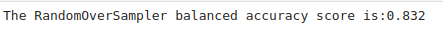
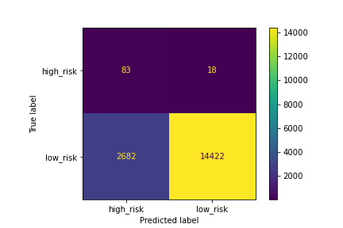
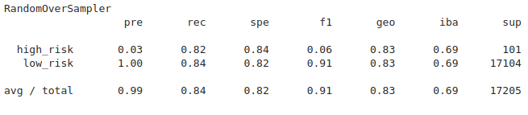
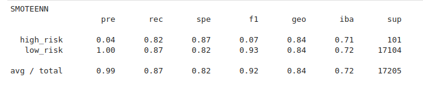
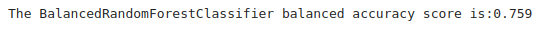
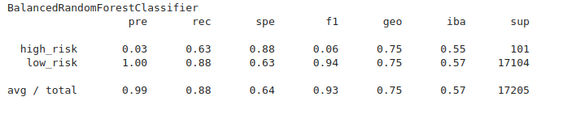
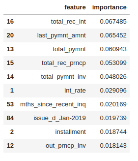
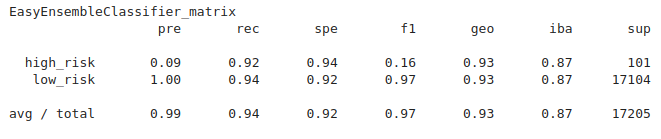

# Credit_Risk_Analysis
Using Supervised Machine Learning to Predict Credit Risk

[Image source](https://media.microbilt.com/Cms_Data/Contents/MBNewsBlogs/Media/images/mbcom/MB-21820.png?width=730&height=335&mode=carve)

## Background

### Overview of Analysis

This project consists of three technical analysis deliverables and a written report.

- Deliverable 1: Use Resampling Models to Predict Credit Risk

- Deliverable 2: Use the SMOTEENN Algorithm to Predict Credit Risk

- Deliverable 3: Use Ensemble Classifiers to Predict Credit Risk

- Deliverable 4: A Written Report on the Credit Risk Analysis (README.md)

### Purpose

Credit risk is an inherently unbalanced classification problem, as good loans easily outnumber risky loans. Therefore, we needed to employ different techniques to train and evaluate models with unbalanced classes.

Using the credit card credit dataset from LendingClub, a peer-to-peer lending services company, we'll oversample the data using the **RandomOverSampler** and **SMOTE** algorithms, and undersample the data using the **ClusterCentroids** algorithm. Then, we’ll use a combinatorial approach of over- and undersampling using the **SMOTEENN** algorithm. Next, we’ll compare two new machine learning models that reduce bias, **BalancedRandomForestClassifier** and **EasyEnsembleClassifier**, to predict credit risk. 

## Resources

Data source:

- (1) credit_risk_ensemble_starter_code, (2) credit_risk_resampling_starter_code, (3) LoanStats_2019Q1

Software:

- Python 3.9.10, Jupyter Lab 4.6, Visual Studio Code 1.71.2
 
 

## Methodology

### D1: Use Resampling Models to Predict Credit Risk

Using the imbalanced-learn and scikit-learn libraries, we  evaluated three machine learning models by using resampling to determine which was better at predicting credit risk. First, we used the oversampling **RandomOverSampler** and **SMOTE** algorithms, and then we used the undersampling **ClusterCentroids** algorithm. Using these algorithms, we resampled the dataset, viewed the count of the targeted classes, trained a logistic regression classifier, calculated the balanced accuracy score, generated a confusion matrix, and generated a classification report.

 

### D2: Use the SMOTEENN algorithm to Predict Credit Risk

Using the imbalanced-learn and scikit-learn libraries, we used a combinatorial approach of over- and undersampling with the SMOTEENN algorithm to determine if the results from the combinatorial approach were better at predicting credit risk than the resampling algorithms from Deliverable 1. Using the **SMOTEENN** algorithm, we resampled the dataset, viewed the count of the targeted classes, trained a logistic regression classifier, calculated the balanced accuracy score, generated a confusion matrix, and generated a classification report.

 

### D3: Use Ensemble Classifiers to Predict Credit Risk

Using the imblearn.ensemble library, we train and compare two different ensemble classifiers, **BalancedRandomForestClassifier** and **EasyEnsembleClassifier**, to predict credit risk and evaluate each model. Using both algorithms, we resampled the dataset, viewed the count of the targeted classes, trained the ensemble classifier, calculated the balanced accuracy score, generated a confusion matrix, and generated a classification report.

 

## Results:

### D1. For all three algorithms, the following have been completed:

#### RandomOverSampler

#### Findings:

- Balance accuracy score: **0.832**
- Precision: high_risk **0.03**, low_risk **1.00**
- Recall: high_risk ***0.82**, low_risk **0.84**
- F1: high_risk **0.06**, low_risk: **0.91**

#### An accuracy score for the model is calculated:

 
 Figure (1.1) RandomOverSampler balanced accuracy report

 

#### A confusion matrix has been generated:

 
 Figure (1.2) RandomOverSampler matrix

 

 #### An imbalanced classification report has been generated:

 
 Figure (1.3) RandomOverSampler imbalanced classification report

 

#### SMOTE

#### Findings:

- Balance accuracy score: **0.884**
- Precision: high_risk **0.03**, low_risk **1.00**
- Recall: high_risk ***0.82**, low_risk **0.87**
- F1: high_risk **0.07**, low_risk: **0.93**
 
#### An accuracy score for the model is calculated:

 
 Figure (1.4) SMOTE balanced accuracy report

 

#### A confusion matrix has been generated:

 
 Figure (1.5) SMOTE confusion matrix

 

#### An imbalanced classification report has been generated:

 
 Figure (1.6) SMOTE imbalanced classification report

 

#### ClusterCentroids
 
#### Findings:

- Balance accuracy score: **0.884**
- Precision: high_risk **0.03**, low_risk **1.00**
- Recall: high_risk ***0.82**, low_risk **0.87**
- F1: high_risk **0.07**, low_risk: **0.93**

#### An accuracy score for the model is calculated:

 
 Figure (1.7) ClusterCentroids balanced accuracy report

 

#### A confusion matrix has been generated:

 
 Figure (1.8) ClusterCentroids_confusion_matrix

 

#### An imbalanced classification report has been generated:

 
 Figure (1.9) ClusterCentroids imbalanced classification report

 

### D2. The combinatorial SMOTEENN algorithm does the following:

#### SMOTEENN
 
#### Findings:

- Balance accuracy score: **0.884**
- Precision: high_risk **0.03**, low_risk **1.00**
- Recall: high_risk ***0.82**, low_risk **0.87**
- F1: high_risk **0.07**, low_risk: **0.93**
 
#### An accuracy score for the model is calculated:

 
 Figure (1.10) SMOTEEN balanced accuracy report

 

#### A confusion matrix has been generated:

 
 Figure (1.11) SMOTEENN matrix

 

#### An imbalanced classification report has been generated:

 
 Figure (1.12) SMOTEENN imbalanced classification report

 

### D3. The algorithm does the following:

#### BalancedRandomForestClassifier
 
#### Findings:

- Balance accuracy score: **0.759**
- Precision: high_risk **0.03**, low_risk **1.00**
- Recall: high_risk ***0.63**, low_risk **0.88**
- F1: high_risk **0.06**, low_risk: **0.94**

 #### An accuracy score for the model is calculated:

 
 Figure (1.13) BalancedRandomForestClassifier balanced accuracy report

 

 #### A confusion matrix has been generated

 
 Figure (n) BalancedRandomForestClassifier matrix

 

#### An imbalanced classification report has been generated:

 
 Figure (1.14) BalancedRandomForestClassifier imbalanced classification report

 

#### The features are sorted in descending order by feature importance:

 
 Figure (1.15) features_sorted_in_descending_order

 

#### EasyEnsembleClassifier
 
#### Findings:

- Balance accuracy score: **0.932**
- Precision: high_risk **0.03**, low_risk **1.00**
- Recall: high_risk **0.92**, low_risk **0.94**
- F1: high_risk **0.16**, low_risk: **0.97**

#### An accuracy score of the model is calculated:

 
 Figure (1.16) EasyEnsembleClassifier balanced accuracy_ report

 

 #### A confusion matrix has been generated:

 
 Figure (1.17) EasyEnsembleClassifier_matrix

 

#### An imbalanced classification report has been generated:

 
 Figure (1.18) EasyEnsembleClassifier imbalanced classification report

 

## Summary

The recall (sensitivity) for prediction of the high risk and low_risk are in line with each other for most of the models. However, the precision for predicting high risk is much lower than it is for predicting low risk. The lower precision for high risk is reflected in the dropped F1 score.

In this scenario, the sensitivity is very high, while the precision is very low. Clearly, this is not a useful algorithm, so let's take a look at the F1 value. A pronounced imbalance between sensitivity and precision will yield a low F1 score. 

#### The F1 values for our models:

- RandomOverSampler - **0.06**

- SMOTE - 0.07

- ClusterCentroids - 0.07

- SMOTEENN - 0.07

- BalancedRandomForestClassifier - 0.06

- EasyEnsembleClassifier - **0.16**

#### The accuracy scores for our models:

- RandomOverSampler - **83.2**

- SMOTE - 88.4

- ClusterCentroids - 88.4

- SMOTEENN - 88.4

- BalancedRandomForestClassifier - 75.9

- EasyEnsembleClassifier - **93.2**
 
To summarize our results, we'll focus on our targeted class (high_risk), out of the 6 models:
 
- RandomOverSampler performed the worst with an F1 value of **0.06** (higher imbalance) and accuracy score of **83.2**.

- EasyEnsembleClassifier performed the best with an F1 value of **0.16** (less imbalance) and accuracy score of **93.2**.
 
In general the models were not very good at predicting high risk since the F1 values for most models were between 0.06-0.07. However, from our 6 models we would recommend the **EasyEnsembleClassifier** since the model did a better job classifying the data, improved the F1 value from 0.06 to **0.16**, and had a better accuracy score with **93.2%**.
 
For future evaluations we may want to explore the use of Precision-Recall Curve to compare the model performances in imbalanced data sets. 

## References

[Markdown](https://docs.github.com/en/get-started/writing-on-github/getting-started-with-writing-and-formatting-on-github/basic-writing-and-formatting-syntax)

[scikit-learn](https://scikit-learn.org/stable/)
 
[imbalanced-learn](https://imbalanced-learn.org/stable/)

