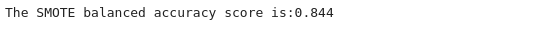
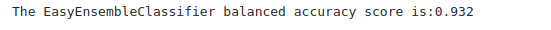

# Credit_Risk_Analysis
Using Supervise Machine Learning to Predict Credit Risk

## Background

### Overview of Analysis

This project consists of three technical analysis deliverables and a written report.

- Deliverable 1: Use Resampling Models to Predict Credit Risk

- Deliverable 2: Use the SMOTEENN Algorithm to Predict Credit Risk

- Deliverable 3: Use Ensemble Classifiers to Predict Credit Risk

- Deliverable 4: A Written Report on the Credit Risk Analysis (README.md)

### Purpose

Credit risk is an inherently unbalanced classification problem, as good loans easily outnumber risky loans. Therefore, you’ll need to employ different techniques to train and evaluate models with unbalanced classes. Jill asks you to use imbalanced-learn and scikit-learn libraries to build and evaluate models using resampling.

Using the credit card credit dataset from LendingClub, a peer-to-peer lending services company, you’ll oversample the data using the RandomOverSampler and SMOTE algorithms, and undersample the data using the ClusterCentroids algorithm. Then, you’ll use a combinatorial approach of over- and undersampling using the SMOTEENN algorithm. Next, you’ll compare two new machine learning models that reduce bias, BalancedRandomForestClassifier and EasyEnsembleClassifier, to predict credit risk. Once you’re done, you’ll evaluate the performance of these models and make a written recommendation on whether they should be used to predict credit risk.

## Resources

Data source:

- (1) credit_risk_ensemble_starter_code, (2) credit_risk_resampling_starter_code, (3) LoanStats_2019Q1

Software:

- Python 3.9.10, Jupyter Lab 4.6, Visual Studio Code 1.71.2
 
 

## Methodology

### D1: Use Resampling Models to Predict Credit Risk

Using the imbalanced-learn and scikit-learn libraries, we  evaluated three machine learning models by using resampling to determine which was better at predicting credit risk. First, we used the oversampling RandomOverSampler and SMOTE algorithms, and then we used the undersampling ClusterCentroids algorithm. Using these algorithms, we resampled the dataset, viewed the count of the targeted classes, trained a logistic regression classifier, calculated the balanced accuracy score, generated a confusion matrix, and generated a classification report.

 

### D2: Use the SMOTEENN algorithm to Predict Credit Risk

Using the imbalanced-learn and scikit-learn libraries, we used a combinatorial approach of over- and undersampling with the SMOTEENN algorithm to determine if the results from the combinatorial approach were better at predicting credit risk than the resampling algorithms from Deliverable 1. Using the SMOTEENN algorithm, we resampled the dataset, viewed the count of the targeted classes, trained a logistic regression classifier, calculated the balanced accuracy score, generated a confusion matrix, and generated a classification report.

 

### D3: Use Ensemble Classifiers to Predict Credit Risk

Using the imblearn.ensemble library, we train and compare two different ensemble classifiers, BalancedRandomForestClassifier and EasyEnsembleClassifier, to predict credit risk and evaluate each model. Using both algorithms, we resampled the dataset, viewed the count of the targeted classes, trained the ensemble classifier, calculated the balanced accuracy score, generated a confusion matrix, and generated a classification report.

 

## Results:

### D1. For all three algorithms, the following have been completed:

#### RandomOverSampler

- An accuracy score for the model is calculated

(a)
 
 Figure (a) Amazon Dataset Schema example

 

- A confusion matrix has been generated

(a)
 
 Figure (a) Amazon Dataset Schema example

 

- An imbalanced classification report has been generated 

(a)
 
 Figure (a) Amazon Dataset Schema example

 

#### SMOTE

- An accuracy score for the model is calculated

(a)
 
 Figure (a) Amazon Dataset Schema example

 

- A confusion matrix has been generated

(a)
 
 Figure (a) Amazon Dataset Schema example

 

- An imbalanced classification report has been generated 

(a)
 
 Figure (a) Amazon Dataset Schema example

 

#### ClusterCentroids

- An accuracy score for the model is calculated

(a)
 
 Figure (a) Amazon Dataset Schema example

 

- A confusion matrix has been generated

(a)
 
 Figure (a) Amazon Dataset Schema example

 

- An imbalanced classification report has been generated 

(a)
 
 Figure (a) Amazon Dataset Schema example

 

### D2. The combinatorial SMOTEENN algorithm does the following:

#### SMOTEENN
- An accuracy score for the model is calculated

(a)
 
 Figure (a) Amazon Dataset Schema example

 

- A confusion matrix has been generated

(a)
 
 Figure (a) Amazon Dataset Schema example

 

- An imbalanced classification report has been generated

(a)
 
 Figure (a) Amazon Dataset Schema example

 

### D3 The algorithm does the following:

#### BalancedRandomForestClassifier

- An accuracy score for the model is calculated

(a)
 
 Figure (a) Amazon Dataset Schema example

 

- A confusion matrix has been generated

(a)
 
 Figure (a) Amazon Dataset Schema example

 

- An imbalanced classification report has been generated

(a)
 
 Figure (a) Amazon Dataset Schema example

 

- The features are sorted in descending order by feature importance

(a)
 
 Figure (a) Amazon Dataset Schema example

 

#### EasyEnsembleClassifier

- An accuracy score of the model is calculated

(a)
 
 Figure (a) Amazon Dataset Schema example

 

- A confusion matrix has been generated

(a)
 
 Figure (a) Amazon Dataset Schema example

 

- An imbalanced classification report has been generated

(a)
 
 Figure (a) Amazon Dataset Schema example

 

## Summary

- 
- 
- 

## References

[Markdown](https://docs.github.com/en/get-started/writing-on-github/getting-started-with-writing-and-formatting-on-github/basic-writing-and-formatting-syntax)

[scikit-learn](https://scikit-learn.org/stable/)
 
[imbalanced-learn](https://imbalanced-learn.org/stable/)

